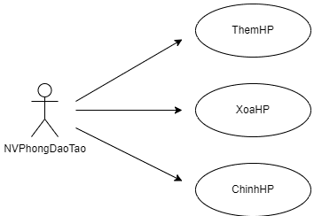
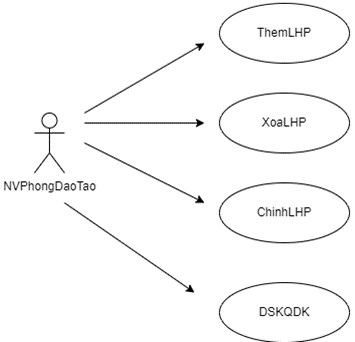
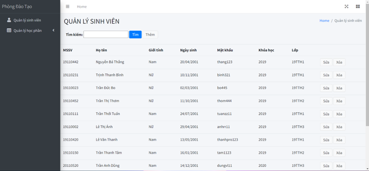
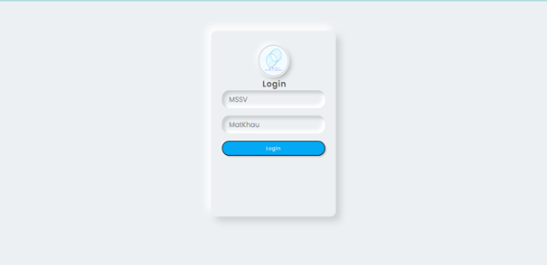

# Course Management System

# Chương 1: Phát biểu bài toán
## 1. Xác định vị trí
Cơ hội: Việc có một hệ thống quản lý học phần, lớp học phần đồng thời quản lý việc đăng ký của sinh viên rất cần thiết.

Trình bày vấn đề: Vấn đề lưu trữ việc đăng ký môn học của sinh viên:
- Vấn đề: Cơ sở dữ liệu về việc đăng ký học phần của sinh viên được lưu trữ thủ công trên giấy làm cho việc quản lý khó khăn
- Các đối tượng có liên quan: Nhân viên phòng đào tạo, người quản lý
- Các ảnh hưởng của vấn đề: Làm việc quản lý lớp học cho từng học phần trở nên khó khăn và tốn nhiều thời gian 
- Giải pháp đề nghị: Tạo hệ thống tích hợp cơ sở dữ liệu giúp việc truy vấn danh sách đăng ký của sinh viên dễ dàng hơn.

Vấn đề lưu trữ danh sách lớp học phần mở kỳ này:
- Vấn đề: Cơ sở dữ liệu về danh sách các lớp học phần được mở ở học kỳ hiện tại được lưu trữ thủ công trên giấy làm cho việc quản lý khó khăn
- Các đối tượng có liên quan: Nhân viên phòng đào tạo, sinh viên
- Các ảnh hưởng của vấn đề: Làm việc quản lý lớp học phần cũng như việc đăng ký của sinh viên trở nên khó khăn và tốn nhiều thời gian
- Giải pháp đề nghị: Tạo hệ thống tích hợp cơ sở dữ liệu giúp việc quản lý danh sách lớp học phần dễ dàng hơn,

## 2. Mô tả Stakeholder và khách hàng
 - Tóm tắt các Stakeholder

| Name | Represent | Role |
|------|-----------|------|
Người quản lý | Người quản lý phòng đào tạo | Theo dõi tiến trình phát triển dự án và theo dõi tình hình phòng đào tạo | 
Nhân viên phòng đào tạo | Người nhập các thông tin | Chịu trách nhiệm việc cập nhập thông tin học phần 
Khoa | Đơn vị quản lý đào tạo cơ sở của trường đại học | Tổ chức hoạt động giáo dục trong chương trình giảng dạy của nhà trường
Giảng viên | Người thực hiện hoạt động giảng dạy ở trường đại học | Đảm nhận giảng dạy lớp học phần

- Tóm tắt các khách hàng

| Name                    | Description                                                                 | Stakeholder             |
| ----------------------- | --------------------------------------------------------------------------- | ----------------------- |
| Người quản lý           | Đáp ứng các nhu cầu quản lý hệ thống                                        | Người quản lý           |
| Nhân viên phòng đào tạo | Đảm bảo rằng hệ thống sẽ đáp ứng các nhu cầu của công việc quản lý học phần | Nhân viên phòng đào tạo |
| Sinh viên               | Đáp ứng nhu cầu đăng ký môn học                                             |                         |
 
<details>
    <summary>Hồ sơ về các Stakeholder và khách hàng</summary>

- Người quản lý:

| **Vai trò**      | Người quản lý phòng đào tạo trường đại học                                                                                      |
| ---------------- | ------------------------------------------------------------------------------------------------------------------------------- |
| **Miêu tả**      | Người quyết định xây dựng hệ thống, theo dõi hoạt động của phòng đào tạo đồng thời quản lý nhân viên phòng đào tạo.             |
| **Loại**         | Người hiểu rõ tình trạng hoạt động của phòng đào tạo                                                                            |
| **Trách nhiệm**  | Mô tả cấu trúc tổ chức và tình trạng hoạt động của phòng đào tạo đồng thời quan sát tình trạng dự án.                           |
| **Tiêu Chí**     | Sự thành công là hoàn thành công việc đúng thời gian và tổ chức tốt cơ sở thiết kế để tiện cho việc cải thiện hệ thống sau này. |
| **Tham gia**     | Project reviewer, admin                                                                                                         |
| **Bàn giao**     | Có, phân phối cho các đồng sự quản lý khác                                                                                      |
| **Nhận/ Vấn đề** | Thời gian thực hiện ngắn so với khối lượng công việc quản lý phòng đào tạo quá nhiều                                            |

- Nhân viên phòng đào tạo:

| **Vai trò**      | Nhân viên ở phòng đào tạo                                                         |
| ---------------- | --------------------------------------------------------------------------------- |
| **Miêu tả**      | Nhân viên làm việc cho trường đại học thuộc phòng đào tạo, thực hiện nghiệp vụ mở |
| **Loại**         | Người có trình độ tin học nhất định và nghiệp vụ mở lớp học phần                  |
| **Trách nhiệm**  | Lập báo cáo cho người quản lý                                                     |
| **Tiêu Chí**     | Sự thành công là hoàn thành công việc hiệu quả, chính xác và nhanh chóng          |
| **Tham gia**     | User                                                                              |
| **Bàn giao**     | Có, phân phối cho các nhân viên phòng đào tạo khác                                |
| **Nhận/ Vấn đề** | Một số thao tác còn thủ công, tốn thời gian quản lý học phần                      |

- Giảng viên:

| **Vai trò**      | Giảng viên dạy học ở trường đại học                                                 |
| ---------------- | ----------------------------------------------------------------------------------- |
| **Miêu tả**      | Người thực hiện hoạt động giảng dạy                                                 |
| **Loại**         | Người có trình độ, học vấn cao về ngành nghề giảng dạy                              |
| **Trách nhiệm**  | Giảng dạy, đánh giá trình độ học của sinh viên và lập báo cáo điểm số của sinh viên |
| **Tiêu Chí**     | Không có                                                                            |
| **Tham gia**     | Không có                                                                            |
| **Bàn giao**     | Không có                                                                            |
| **Nhận/ Vấn đề** | Thông tin về lớp học dễ lẫn lộn                                                     |

- Khoa:

| **Vai trò**      | Khoa-bộ môn trong trường đại học                                     |
| ---------------- | -------------------------------------------------------------------- |
| **Miêu tả**      | Đơn vị quản lý hành chính của trường đại học                         |
| **Loại**         | Không có                                                             |
| **Trách nhiệm**  | Quản lý các giảng viên và cung cấp danh sách giảng viên đảm nhận lớp |
| **Tiêu Chí**     | Không có                                                             |
| **Tham gia**     | Không có                                                             |
| **Bàn giao**     | Không có                                                             |
| **Nhận/ Vấn đề** | Không có                                                             |

- Sinh viên:

| **Vai trò**      | Học viên tại trường đại học                      |
| ---------------- | ------------------------------------------------ |
| **Miêu tả**      | Người đăng ký học phần                           |
| **Loại**         | Không có                                         |
| **Trách nhiệm**  | Không có                                         |
| **Tiêu Chí**     | Sự thành công là có hệ thống dễ đăng ký học phần |
| **Tham gia**     | User                                             |
| **Bàn giao**     | Không có                                         |
| **Nhận/ Vấn đề** | Quy trình đăng ký môn học chưa được tiện lợi     |

</details>

## 3. Khảo sát hệ thống
<details>
    <summary>Trường đại học Khoa Học Tự Nhiên (HCMUS)</summary>

3.1.	Trường đại học Khoa Học Tự Nhiên

Trường Đại Học Khoa Học Tự Nhiên - Đại học Quốc gia thành phố Hồ Chí Minh (ĐHQG TP.HCM) là cơ sở đào tạo đại học, sau đại học và nghiên cứu khoa học (NCKH), chuyển giao công nghệ (CGCN) có nhiệm vụ đào tạo nhân lực, bồi dưỡng nhân tài, nghiên cứu và triển khai ứng dụng khoa học cơ bản và công nghệ về những ngành khoa học công nghệ (KHCN) có liên quan.

Trường Đại Học Khoa Học Tự Nhiên - ĐHQG TP.HCM có quyền hạn và nhiệm vụ theo quy định của Luật Giáo dục 2005, hướng dẫn thi hành một số điều của Luật Giáo dục quy định tại Nghị định số 75/2006/NĐ-CP ngày 02 tháng 8 năm 2006 của Chính phủ, Quy chế về tổ chức và hoạt động của Đại học Quốc Gia ban hành kèm theo Quyết định số 16/2001/QĐ-TT ngày 12 tháng 02 năm 2001 của Thủ tướng Chính phủ, Điều lệ trường đại học ban hành kèm theo Quyết định số 153/2003/QĐ-TTg ngày 30 tháng 7 năm 2003 của Thủ tướng Chính phủ.

Trường Đại Học Khoa Học Tự Nhiên chịu sự quản lý trực tiếp của ĐHQG TP.HCM. Trường Đại Học Khoa Học Tự Nhiên là tổ chức có tư cách pháp nhân, có con dấu và tài khoản riêng, được quyền tự chủ và tự chịu trách nhiệm theo quy định của pháp luật và của ĐHQG TP.HCM về quy hoạch, kế hoạch phát triển, tổ chức các hoạt động đào tạo, khoa học và công nghệ, tài chính, quan hệ quốc tế, tổ chức và nhân sự, có trách nhiệm phối hợp hoạt động chiến lược theo kế hoạch chung của ĐHQG TP.HCM.

3.2	Các Khoa

Khoa là đơn vị quản lý hành chính cơ sở của trường, có trách nhiệm chủ trì và phối hợp với các phòng, ban chức năng thực hiện các nhiệm vụ sau đây:
<ol type = "a" start="1">
<li>Xây dựng chương trình, kế hoạch giảng dạy, học tập và tổ chức quá trình đào tạo một hoặc một số ngành; tổ chức các hoạt động giáo dục khác trong chương trình, kế hoạch giảng dạy chung của nhà trường</li>
<li>Xây dựng kế hoạch và tổ chức thực hiện các hoạt động KHCN; triển khai thực hiện các dự án hợp tác quốc tế; phối hợp với các tổ chức KHCN, các doanh nghiệp; gắn hoạt động đào tạo với NCKH-CGCN, phát triển kinh tế xã hội. </li>
<li>Xây dựng quy hoạch, phát triển đội ngũ giảng viên. Quản lý, tổ chức đào tạo, bồi dưỡng nâng cao phẩm chất chính trị, tư tưởng, đạo đức, lối sống, trình độ chuyên môn, nghiệp vụ cho giảng viên và nhân viên thuộc khoa. Quản lý người học theo quy định của trường.</li>
<li>Quản lý chất lượng, nội dung, phương pháp đào tạo và NCKH; tổ chức biên soạn giáo trình; tổ chức nghiên cứu cải tiến phương pháp giảng dạy, học tập.</li>
<li>Đề xuất xây dựng kế hoạch phát triển, quản lý, bảo trì cơ sở vật chất trang thiết bị phục vụ đào tạo, NCKH-CGCN.</li>
</ol>

Đứng đầu các khoa là Trưởng khoa do Hiệu trưởng bổ nhiệm, miễn nhiệm. Giúp việc cho Trưởng khoa có các Phó trưởng khoa do Hiệu trưởng bổ nhiệm, miễn nhiệm theo đề nghị của Trưởng khoa. Nhiệm kỳ của Trưởng khoa và Phó trưởng khoa là 5 năm và có thể được bổ nhiệm lại nhưng không quá hai nhiệm kỳ liên tiếp.

3.3. Quy chế đào tạo theo học chế tín chỉ cho hệ đại học và cao đẳng chính quy

3.3.1. Chương trình đào tạo

Chương trình đào tạo (sau đây gọi tắt là chương trình) là những thông tin cơ bản mà sinh viên cần nắm vững trong quá trình học tập, bao gồm: mục tiêu đào tạo, chuẩn đầu ra kiến thức, kỹ năng, thái độ, trách nhiệm nghề nghiệp của sinh viên khi tốt nghiệp; khối lượng kiến thức lý thuyết, thực hành, thực tập; kế hoạch đào tạo theo thời gian thiết kế; phương pháp và hình thức đào tạo; cách thức đánh giá kết quả học tập; các điều kiện thực hiện chương trình. 

Mỗi chương trình gắn với một ngành hoặc với một vài ngành và được cấu trúc từ các học phần thuộc hai khối kiến thức: giáo dục đại cương và giáo dục chuyên nghiệp. Khối kiến thức giáo dục đại cương nhằm trang bị cho sinh viên nền học vấn rộng: có thế giới quan khoa học và nhân sinh quan đúng đắn; hiểu biết về tự nhiên, xã hội và con người; nắm vững phương pháp tư duy khoa học; có đạo đức, nhận thức trách nhiệm công dân; có năng lực tham gia xây dựng và bảo vệ đất nước. Khối kiến thức giáo dục chuyên nghiệp được thể hiện theo 2 nhóm: nhóm kiến thức cơ sở ngành hoặc liên ngành và nhóm kiến thức chuyên ngành, nhằm cung cấp cho sinh viên những kiến thức và kỹ năng nghề nghiệp ban đầu cần thiết.

Đề cương chi tiết của từng học phần thể hiện rõ mục tiêu, số lượng tín chỉ, điều kiện tiên quyết (nếu có), nội dung lý thuyết và thực hành, cách thức đánh giá học phần, giáo trình, tài liệu tham khảo và điều kiện thí nghiệm, thực hành, thực tập phục vụ học phần

3.3.2. Học phần và tín chỉ

Học phần là khối lượng kiến thức tương đối trọn vẹn, thuận tiện cho sinh viên tích lũy trong quá trình học tập. Nội dung được bố trí giảng dạy trọn vẹn và phân bố đều trong một học kỳ. Từng học phần được ký hiệu bằng một mã số riêng do trường quy định.
  
Có hai loại học phần: học phần bắt buộc và học phần tự chọn: 
<ol type="a" start=1>
<li>Học phần bắt buộc là học phần chứa đựng những nội dung kiến thức chính yếu của mỗi chương trình và bắt buộc sinh viên phải tích lũy;
<li>Học phần tự chọn là học phần chứa đựng những nội dung kiến thức cần thiết, nhưng sinh viên được tự chọn theo hướng dẫn của Trường nhằm đa dạng hoá hướng chuyên môn hoặc được tự chọn tùy ý để tích lũy đủ số học phần quy định cho mỗi chương trình.
</ol>
Tín chỉ được sử dụng để tính khối lượng học tập của sinh viên. Một tín chỉ được quy định bằng 15 tiết học lý thuyết; 30 - 45 tiết thực hành, thí nghiệm hoặc thảo luận; 45 - 90 giờ thực tập tại cơ sở; 45 - 60 giờ làm tiểu luận, bài tập lớn hoặc đồ án, khóa luận tốt nghiệp. Một tiết học được tính bằng 50 phút.

Ngoài việc được phân loại là bắt buộc hoặc tự chọn, các học phần có các khái niệm khác như sau: 
<ol type="a" start=1>
<li>Học phần chung (Giáo dục Quốc phòng - An ninh, Giáo dục Thể chất, các học phần lý luận chính trị …) là các học phần được giảng dạy chung cho tất cả các ngành theo quy định.
<li>Học phần tiên quyết: một học phần là tiên quyết đối với học phần A là học phần mà sinh viên phải học và thi đạt mới được theo học phần A. 
<li>Học phần song hành: Hai học phần được gọi là song hành khi sinh viên đăng ký học phần này thì bắt buộc phải đăng ký học phần kia. 
<li>Học phần thay thế: là học phần được sử dụng thay thế cho một học phần đã được thay đổi hoặc điều chỉnh, không còn tổ chức giảng dạy trong chương trình. 
<li>Học phần tương đương: một học phần được gọi là tương đương với học phần A khi có nội dung kiến thức và thời lượng đáp ứng yêu cầu cơ bản của học phần A. 
<li>Học phần tự chọn định hướng: là học phần mà sinh viên phải chọn trong các học phần quy định cho một ngành, chuyên ngành cụ thể. 
</ol>Các học phần được gọi là tích lũy khi điểm đánh giá học phần đạt từ điểm 5,0 trở lên.

3.3.3. Tổ chức lớp 

1. Lớp học phần: Những sinh viên theo học cùng một học phần trong cùng một khoảng thời gian và cùng một giảng viên tạo thành một lớp học phần. Mỗi lớp học phần được ký hiệu bằng một mã số riêng do trường quy định. 
2. Lớp sinh hoạt: Những sinh viên cùng khóa tuyển, nếu có chung ≥ 60 % số lớp học phần trong tổng số các lớp học phần của cùng một học kỳ được tổ chức thành một lớp sinh hoạt. Lớp sinh hoạt nhằm mục đích tạo điều kiện cho sinh viên sinh hoạt đoàn thể.

3.4. Quá trình đăng ký học phần:

3.4.1. Khảo sát bên phòng đào tạo

Bên phòng đào tạo có thể thêm vào sinh viên mới trong mỗi khoá học mới, ví dụ như đầu năm học mới, các tân sinh viên được tuyển vào trường, phòng đạo tạo sẽ nhập các sinh viên này vào cơ sở dữ liệu của hệ thống nhà trường, để thực hiện việc quản lý sinh viên.

Một sinh viên sẽ được xác định bởi mã số sinh viên duy nhất, và 2 số đầu của mã sinh viên cho biết khoá học của sinh viên, ví dụ như mã số 19110317 tức là sinh viên này đã thi tuyển đầu vào năm 2019. Các thông tin khác về sinh viên như họ, tên đệm, tên, giới tính, ngày sinh và quê quán sinh viên. Mỗi sinh viên thuộc một khoa duy nhất, được xác định từ lúc sinh viên có nguyện vọng thi vào trường, ví dụ như sinh viên với mã số 19110442 thuộc về khoa Toán - Tin học. Ngoài ra, để tạo ra một nhóm sinh viên nòng cốt, ở mỗi khoa còn có việc tuyển chọn ra một lớp có điểm thi đầu vào cao và có nguyện vọng vào lớp học này, đó gọi là lớp cử nhân tài năng, được đào tạo riêng theo chương trình cử nhân tài năng, những sinh viên khác gọi là chính quy.

Đầu tiên các giảng viên trong trường sẽ có một buổi họp để thảo luận và chọn các môn mình sẽ đảm nhiệm dạy trong danh sách các môn học được mở trong học kì hiện tại đến khoa của mình đang công tác, sau khi tập hợp đầy đủ các thông tin, các khoa gửi đến phòng đạo tạo danh sách môn học kèm theo tên giảng viên để phòng đạo tạo phê duyệt và cập nhật đến sinh viên.

Một môn học được xác định mã môn học duy nhất, tên môn học và số tin chỉ ứng với môn học đó, ngoài ra một môn học còn có thể có các môn học tiên quyết của nó, tức là phải học các môn tiên quyết thì mới được phép đăng ký học môn học này.

Một lớp học phần sẽ được áp dụng cho một nhóm sinh viên nào đó được phép đăng ký. Các sinh viên này được phân nhóm theo khoa (ví dụ: nhóm sinh viên thuộc khoa Toán - Tin học, ...). Từng nhóm sinh viên theo khoa sẽ được phân ra các nhóm theo niên khoá (ví dụ: các sinh viên khoa Toán - Tin học khóa 2019, 2020, ...). Ở mỗi khoa, ứng với từng niên khóa sinh viên được chia ra làm 2 chương trình đào tạo: các sinh viên theo chương trình chính quy (CQ) và các sinh viên theo chương trình đào tạo cử nhân tài năng (CNTN). Vì vậy, phòng đào tạo sẽ phân sinh viên ra làm ba nhóm là theo khoa, niên khoá và chương trình đào tạo (CQ hoặc CNTN).

Một lớp học phần được lập ra sẽ có các thuộc tính như thời gian của lịch học được tạo ra, cụ thể là năm học và học kỳ. Một năm học sẽ có 2 hoặc 3 học kỳ, học kỳ thứ 3 gọi là học kỳ hè.

Một lớp học phần được lập ra phải cho biết học phần ứng với lớp học phần. Một học phần được xác định bởi mã học phần duy nhất, tên học phần và số tín chỉ.

Một lớp học phần phải cho biết lớp học phần đó có mã lớp là mã nào, ví dụ như môn Anh văn, khi một lớp học phần được lập ra áp dụng cho 1 nhóm cố định nào đó, thì có thể có nhiều lớp học phần áp dụng cho học phần đó nhưng khác mã số lớp, bởi vì số lượng rất đông nên phải chia thành nhiều lớp nhiều ca, do đó sẽ có thể có nhiều lớp học phần cho học phần này và các lớp mở ra sẽ có mã số lớp như A, B, C, D hoặc 1, 2, 3, 4. Thông thường các lớp học phần mở ra dành riêng cho lớp cử nhân tài năng sẽ có mã số lớp bắt đầu bằng chữ N.

Một lớp học phần sẽ cho biết tiết bắt đầu và tiết kết thúc của học phần đó. Một lớp học phần cho biết giảng viên phụ trách của môn học đó. Giảng viên xác định bởi tên duy nhất, học vị và email. Thực tế sẽ không có 2 giảng viên nào trùng tên trong trường do cách đặt thêm ký tự A, B, C vào mỗi giảng viên trùng tên, như Nguyễn Văn Thìn A, Nguyễn Văn Thìn B.

Ngoài ra một lớp học phần còn phải đảm bảo về số lượng tối đa sinh viên đăng ký.

Vì mỗi học kỳ ứng với mỗi năm học khác nhau, danh sách sinh viên và môn học có thể khác nhau, do đó phòng đào tạo phải cập nhật lại thông tin trước khi thời gian đăng ký bắt đầu.

Và sau khi hết thời gian đăng ký, có thể do một số lý do chính đáng; chẳng hạn như: số lượng sinh viên đăng ký lớp học phần đó nhỏ hơn một con số cụ thể (5) thì lớp học phần đó sẽ bị huỷ và sinh viên sẽ được đăng ký lại lớp học phần khác nếu cần; hoặc trong quá trình học tập có một vài lý do nào đó sinh viên không thể tiếp tục học thì có thể lên phòng đào tạo để hiệu chỉnh, với điều kiện là trong thời gian cho phép nào đó.


3.4.2. Khảo sát bên sinh viên

Trước khi bắt đầu cho học kỳ mới, phòng đào tạo sẽ mở ra một khoảng thời gian cho sinh viên đăng ký học phần.

Thủ tục đăng ký học phần như sau:

Sinh viên sẽ vào tài khoản của mình bằng cách đăng nhập bởi tên đăng nhập là mã số sinh viên (MSSV), và mật khẩu cho lần đầu tiên đăng nhập cũng chính là MSSV của sinh viên đó, sau khi đăng nhập lần đầu, sinh viên có thể thay đổi mật khẩu riêng của mình. Ví dụ sinh viên với mã số 19110317 sẽ được cấp một tài khoản với tên đăng nhập và mật khẩu là 19110317, sau đó sinh viên có quyền thay đổi mật khẩu.

Khi vào tài khoản của mình, sinh viên sẽ thấy ba mục: mục thông tin chung, mục đăng ký học phần, mục danh sách lớp mở.

Bấm vào mục thông tin chung, sinh viên sẽ thấy các thông tin về mình như Mã sinh viên, họ tên, giới tính, ngày sinh, khoa. 

Bấm vào mục danh sách lớp mở chứa danh sách các lớp được mở trong học kỳ này, tức là những môn học mà sinh viên được phép đăng ký trong học kỳ chuẩn bị học. Sinh viên thuộc nhóm nào, tức là ràng buộc với 3 yếu tố về khoá học, ngành học, chương trình đào tạo thì sẽ nhìn thấy danh sách môn học được phép đăng ký của mình khác nhau.

Còn ở mục đăng ký học phần sẽ là bảng danh sách các học phần cho phép sinh viên đăng ký học phần được mở ở học kì hiện tại. Trong bảng danh sách mỗi dòng là 1 học phần đăng ký. Thông tin mỗi học phần được phép đăng ký bao gồm Mã học phần, Tên học phần, TC (số tín chỉ của học phần), Lớp, Phòng, Sỉ số đăng ký (số sinh viên tối đa cho phép đăng ký), Đã đăng ký (số sinh viên đã đăng ký học phần đó), và một ô checkbox để sinh viên đánh dấu vào nếu có ý định chọn học phần đó. Sau khi đánh dấu tất cả các học phần mình đã chọn, sinh viên ấn vào nút Đồng Ý phía dưới để hệ thống nhập vào cơ sở dữ liệu xác nhận sinh viên đã đăng ký những học phần mình chọn, nếu sinh viên đăng ký vượt quá số tín chỉ hệ thống sẽ thông báo và không cho sinh viên đăng ký. Sau khi ấn nút Đồng Ý thì danh sách các học phần sinh viên đã đăng ký cũng hiển thị bên trên, đồng thời các học phần đăng ký hoặc những học phần trùng với học phần đã đăng ký nhưng khác lớp trong bảng danh sách các học phần cũng tự động ẩn đi. Trường hợp sau khi ấn Đồng Ý, sinh viên muốn thêm một số môn học nào nữa thì có thể làm tương tự như trước. Ngược lại, trường hợp sinh viên muốn huỷ bỏ học phần mà mình đã đã đăng ký thì ở cuối dòng mỗi học phần có ô checkbox để sinh viên đánh dấu nếu không muốn đăng ký học phần đó nữa. Sau khi sinh viên ấn nút huỷ đăng ký thì các học phần được chọn để huỷ cũng như các học phần trùng với học phần đó nhưng khác lớp cũng hiển thì trở lại trên danh sách các học phần cho phép đăng ký.

</details>

# Chương 2: Mô hình Use-Case

## 1. Sơ đồ Use-case
- Quyền quản lý hệ thống<br>


- Quyền quản lý học phần<br>


- Quyền quản lý lớp học phần<br>


- Quyền quản lý sinh viên<br>


- Quyền đăng ký học phần<br>


## 2. Danh sách các Actor
| STT | Tên Actor     | Ý nghĩa/Ghi chú              |
| --- | ------------- | ---------------------------- |
| 1   | QuanLy        | Người quản lý phòng đào tạo  |
| 2   | NVPhongDaoTao | Nhân viên phòng đào tạo      |
| 3   | SinhVien      | Sinh viên của trường đại học |


## 3. Danh sách các Use-case

| STT | Tên Use-case | Ý nghĩa/Ghi chú                             |
| --- | ------------ | ------------------------------------------- |
| 1   | ThemHP       | Thêm học phần                               |
| 2   | XoaHP        | Xóa học phần                                |
| 3   | ChinhHP      | Chỉnh sửa học phần                          |
| 4   | ThemLHP      | Thêm lớp học phần                           |
| 5   | XoaLHP       | Xóa lớp học phần                            |
| 6   | ChinhLHP     | Chỉnh sửa lớp học phần                      |
| 7   | DangKyHP     | Đăng ký học phần                            |
| 8   | XemKQDK      | Xem lịch sử đăng ký                         |
| 9   | TimKiem      | Tìm kiếm thông tin học phần                 |
| 10  | CapNhat      | Đổi mật khẩu tài khoản                      |
| 11  | DangNhap     | Người dùng đăng nhập hệ thống               |
| 12  | QuanLyNV     | Quản lý tài khoản nhân viên hệ thống        |
| 13  | XemLSM       | Xem lịch sử lớp học phần được tạo           |
| 14  | XemLSĐK      | Xem lịch sử đăng ký của sinh viên           |
| 15  | DSKQDK       | Xem số lượng sinh viên đăng ký lớp học phần |
| 16  | ThemSV       | Thêm tài khoản sinh viên vào hệ thống       |
| 17  | XoaSV        | Xóa tài khoản sinh viên khỏi hệ thống       |
| 18  | ChinhSV      | Chỉnh sửa thông tin tài khoản sinh viên     |
| 19  | TimSV        | Tìm kiếm thông tin sinh viên                |


## 4. Đặc tả Use-case
<details>
    <summary style ="font-weight: bolder">Đặc tả Use-case: "Thêm học phần"</summary>

● **Tóm tắt**: Use case này cho phép nhân viên phòng đào tạo thêm một học phần vào danh sách các học phần.<br>
● **Dòng sự kiện**: 
- **Dòng sự kiện chính**:
    - Use case này bắt đầu khi nhân viên phòng đào tạo bấm vào nút ‘Thêm’ ở trên danh sách các học phần. Một trang xuất hiện với tiêu đề “Thêm học phần” chứa các dòng trống để điền các thông tin cần thiết của học phần, trên đầu mỗi dòng có tên của thông tin cần điền vào.
    - Các thông tin cần thiết bao gồm: mã học phần, tên học phần, tín chỉ, khoa, học phần tiên quyết 
    - Hệ thống sẽ trở về danh sách học phần khi nhân viên phòng đào tạo bấm nút 'Lưu' hoặc 'Hủy'. Nếu bấm nút 'Lưu' một học phần mới sẽ được thêm vào danh sách học phần và thông tin học phần sẽ được lưu giữ trong database. Nếu bấm nút 'Hủy' sẽ không có điều gì thay đổi.
- **Các dòng sự kiện khác**:
    - ⮚ Thông tin học phần không đầy đủ
        - Nếu nhân viên phòng đào tạo bấm nút 'Lưu' mà có thông tin bị thiếu thì một thông báo sẽ xuất hiện trên đầu thông báo 'thông tin bị thiếu" và sẽ không lưu học phần này và tiếp tục use case.
    - ⮚ Thông tin học phần không hợp lệ
        - Nếu nhân viên phòng đào tạo bấm nút 'Lưu' mà trong số các thông tin được nhân viên phòng đào tạo nhập vào không hợp lệ thì một thông báo sẽ xuất hiện ở dưới thông tin đó, thông báo sẽ về thể loại dữ liệu của thông tin để nhân viên phòng đào tạo biết đồng thời sẽ không lưu học phần này và tiếp tục use case. 

● **Các yêu cầu đặc biệt**: Không có.<br>
● **Trạng thái hệ thống khi bắt đầu thực hiện Use-case**: Nhân viên phòng đào tạo phải đăng nhập vào hệ thống trước khi Use case này bắt đầu.<br>
● **Trạng thái hệ thống sau khi thực hiện Use-case**: Nếu Use case thành công, học phần mới sẽ được thêm vào danh sách học phần và thông tin học phần sẽ được lưu giữ trong database. Ngược lại sẽ không có gì thay đổi.<br>
● **Điểm mở rộng**: Không có.<br>

</details>

<details>
    <summary style ="font-weight: bolder">Đặc tả Use-case: "Xoá học phần"</summary>

● **Tóm tắt**: Use case này cho phép nhân viên phòng đào tạo xóa một học phần trong danh sách các học phần.<br>
● **Dòng sự kiện**:
- **Dòng sự kiện chính**:
    - Use case này bắt đầu khi nhân viên phòng đào tạo bấm vào nút Delete ở cuối dòng của một học phần trong danh sách các học phần. Một trang mới xuất hiện chứa thông tin học phần được chọn kèm theo hai nút ‘Xóa’ và 'Hủy' ở cuối.
    - Hệ thống sẽ qua lại danh sách học phần khi nhân viên phòng đào tạo bấm nút ‘Xóa’ hoặc 'Hủy'. Nếu bấm nút ‘Xóa’ học phần được chọn để xóa sẽ bị xóa khỏi danh sách học phần và thông tin học phần cũng sẽ được xóa khỏi database. Nếu bấm nút 'Hủy' thì sẽ hủy use case.
- **Các dòng sự kiện khác**: Không có.
● **Các yêu cầu đặc biệt**: Không có.

● **Trạng thái hệ thống khi bắt đầu thực hiện Use-case**:
- Nhân viên phòng đào tạo phải đăng nhập vào hệ thống trước khi Use case này bắt đầu.
- Trong hệ thống phải có danh sách học phần.

● **Trạng thái hệ thống sau khi thực hiện Use-case**: Nếu Use case thành công, học phần được chọn sẽ bị xóa khỏi danh sách học phần và thông tin học phần cũng sẽ xóa khỏi database. Ngược lại sẽ không có gì thay đổi.<br>
● **Điểm mở rộng**: Không có.

</details>

<details>
    <summary style ="font-weight: bolder">Đặc tả Use-case: "Chỉnh sửa học phần"</summary>

● **Tóm tắt**: Use case này cho phép nhân viên phòng đào tạo chỉnh sửa một học phần trong danh sách các học phần.
● **Dòng sự kiện**
- **Dòng sự kiện chính**:
    - Use case này bắt đầu khi nhân viên phòng đào tạo bấm vào nút Edit ở cuối dòng của một học phần trong danh sách các học phần. Một trang xuất hiện với tiêu đề “Chỉnh sửa học phần” chứa các thông tin của học phần.
    - Hệ thống sẽ quay lại danh sách học phần khi nhân viên phòng đào tạo bấm nút 'Lưu' hoặc 'Hủy'. Nếu bấm nút 'Lưu' những thông tin được sửa đổi của học phần sẽ được cập nhật ở danh sách học phần và đồng thời ở database. Nếu bấm nút 'Hủy' thì sẽ hủy use case.
- **Các dòng sự kiện khác**:
    - ⮚	Thông tin học phần không hợp lệ
      - Nếu nhân viên phòng đào tạo bấm nút 'Lưu' mà trong số các thông tin được nhân viên phòng đào tạo nhập vào không hợp lệ thì một thông báo sẽ xuất hiện ở dưới thông tin đó, thông báo sẽ về thể loại dữ liệu của thông tin để nhân viên phòng đào tạo biết đồng thời sẽ không lưu học phần này và tiếp tục use case.

● **Các yêu cầu đặc biệt**: Không có.
● **Trạng thái hệ thống khi bắt đầu thực hiện Use-case**: 
- Nhân viên phòng đào tạo phải đăng nhập vào hệ thống trước khi Use case này bắt đầu.
- Hệ thống phải có danh sách học phần.

● **Trạng thái hệ thống sau khi thực hiện Use-case**: Nếu Use case thành công, học phần được chọn sẽ được cập nhật lại mới và thông tin học phần cũng sẽ được cập nhật lại tại database. Ngược lại sẽ không có gì thay đổi.
● **Điểm mở rộng**: Không có.

</details>

<details>
    <summary style ="font-weight: bolder">Đặc tả Use-case: "Thêm lớp học phần"</summary>

● **Tóm tắt**: Use case này cho phép nhân viên phòng đào tạo thêm một lớp học phần vào danh sách các lớp học phần của học kì hiện tại.<br>
● **Dòng sự kiện**
- **Dòng sự kiện chính**:
    - Use case này bắt đầu khi nhân viên phòng đào tạo bấm vào nút ‘Thêm’ ở trên danh sách các lớp học phần. Một trang xuất hiện với tiêu đề “Thêm lớp học phần” chứa các dòng trống để điền các thông tin cần thiết của học phần, trên đầu mỗi dòng có tên của thông tin cần điền vào. 
    - Các thông tin cần thiết bao gồm: Tên học phần, tên lớp, sĩ số, loại,  lịch học(thứ, tiết bắt đầu và kết thúc), phòng, địa điểm, học kỳ, năm .
    - Hệ thống sẽ trở về danh sách lớp học phần khi nhân viên phòng đào tạo bấm nút 'Lưu' hoặc 'Hủy'. Nếu bấm nút 'Lưu' một lớp học phần mới sẽ được thêm vào cuối danh sách lớp học phần và thông tin lớp học phần sẽ được lưu giữ trong database. Nếu bấm nút 'Hủy' sẽ không có điều gì thay đổi.
- **Các dòng sự kiện khác**:
    - ⮚	Thông tin học phần không đầy đủ
        - Nếu nhân viên phòng đào tạo bấm nút 'Lưu' mà có thông tin bị thiếu thì một thông báo sẽ xuất hiện trên đầu thông báo 'thông tin bị thiếu" và sẽ không lưu lớp học phần này và tiếp tục use case.
    - ⮚	Thông tin học phần không hợp lệ
        - Nếu nhân viên phòng đào tạo bấm nút 'Lưu' mà trong số các thông tin được nhân viên phòng đào tạo nhập vào không hợp lệ thì một thông báo sẽ xuất hiện ở dưới thông tin đó, thông báo sẽ về thể loại dữ liệu của thông tin để nhân viên phòng đào tạo biết đồng thời sẽ không lưu lớp học phần này và tiếp tục use case. 

● **Các yêu cầu đặc biệt**: Không có.<br>
● **Trạng thái hệ thống khi bắt đầu thực hiện Use-case**: 
- Nhân viên phòng đào tạo phải đăng nhập vào hệ thống trước khi Use case này bắt đầu.
- Hệ thống phải có danh sách học phần.

● **Trạng thái hệ thống sau khi thực hiện Use-case**: Nếu Use case thành công lớp học phần mới sẽ được thêm vào danh sách lớp học phần và thông tin lớp học phần sẽ được lưu giữ trong database. Ngược lại sẽ không có gì thay đổi.
● **Điểm mở rộng**: Không có.

</details>

<details>
    <summary style ="font-weight: bolder">Đặc tả Use-case: "Xóa lớp học phần"</summary>

● **Tóm tắt**: Use case này cho phép nhân viên phòng đào tạo xóa một lớp học phần trong danh sách các lớp học phần của học kì hiện tại.<br>
● **Dòng sự kiện**
- **Dòng sự kiện chính**:
    - Use case này bắt đầu khi nhân viên phòng đào tạo bấm vào nút Delete ở cuối dòng của một lớp học phần trong danh sách các lớp học phần. Một trang mới xuất hiện chứa thông tin lớp học phần được chọn kèm theo hai nút ‘Xóa’ và 'Hủy' ở cuối.
    - Hệ thống sẽ qua lại danh sách học phần khi nhân viên phòng đào tạo bấm nút ‘Xóa’ hoặc 'Hủy'. Nếu bấm nút ‘Xóa’ lớp học phần được chọn để xóa sẽ bị xóa khỏi danh sách lớp học phần và thông tin lớp học phần cũng sẽ được xóa khỏi database. Nếu bấm nút 'Hủy' thì sẽ hủy use case.
- **Các dòng sự kiện khác**: Không có.<br>

● **Các yêu cầu đặc biệt**: Không có.<br>
● **Trạng thái hệ thống khi bắt đầu thực hiện Use-case**: 
- Nhân viên phòng đào tạo phải đăng nhập vào hệ thống trước khi Use case này bắt đầu.
- Hệ thống phải có danh sách lớp học phần

● **Trạng thái hệ thống sau khi thực hiện Use-case**: Nếu Use case thành công lớp học phần được chọn sẽ bị xóa khỏi danh sách lớp học phần và thông tin lớp học phần cũng sẽ xóa khỏi database. Ngược lại sẽ không có gì thay đổi.
● **Điểm mở rộng**: Không có.

</details>

<details>
    <summary style ="font-weight: bolder">Đặc tả Use-case: "Chỉnh sửa lớp học phần"</summary>

● **Tóm tắt**: Use case này cho phép nhân viên phòng đào tạo chỉnh sửa một lớp học phần trong danh sách các lớp học phần của học kì hiện tại.<br>
● **Dòng sự kiện**
- **Dòng sự kiện chính**:
    - Use case này bắt đầu khi nhân viên phòng đào tạo bấm vào nút Edit ở cuối dòng của một lớp học phần trong danh sách các lớp học phần. Một trang xuất hiện với tiêu đề “Chỉnh sửa học phần” chứa các thông tin của lớp học phần.
    - Hệ thống sẽ quay lại danh sách lớp học phần khi nhân viên phòng đào tạo bấm nút 'Lưu' hoặc 'Hủy'. Nếu bấm nút 'Lưu' những thông tin được sửa đổi của lớp học phần sẽ được cập nhật ở danh sách lớp học phần và đồng thời ở database. Nếu bấm nút 'Hủy' thì sẽ hủy use case.
- **Các dòng sự kiện khác**:
    - ⮚ Thông tin học phần không hợp lệ
        - Nếu nhân viên phòng đào tạo bấm nút 'Lưu' mà trong số các thông tin được nhân viên phòng đào tạo nhập vào không hợp lệ thì một thông báo sẽ xuất hiện ở dưới thông tin đó, thông báo sẽ về thể loại dữ liệu của thông tin để nhân viên phòng đào tạo biết đồng thời sẽ không lưu học phần này và tiếp tục use case. 

● **Các yêu cầu đặc biệt**: Không có.<br>
● **Trạng thái hệ thống khi bắt đầu thực hiện Use-case**: 
- Nhân viên phòng đào tạo phải đăng nhập vào hệ thống trước khi Use case này bắt đầu.
- Hệ thống phải có danh sách lớp học phần

● **Trạng thái hệ thống sau khi thực hiện Use-case**: Nếu Use case thành công lớp học phần được chọn sẽ được cập nhật lại mới và thông tin lớp học phần cũng sẽ được cập nhật lại tại database. Ngược lại sẽ không có gì thay đổi.
● **Điểm mở rộng**: Không có.

</details>

<details>
    <summary style ="font-weight: bolder">Đặc tả Use-case: "Đăng ký học phần"</summary>

● **Tóm tắt**: Use case này cho phép sinh viên đăng ký các học phần trong danh sách các học phần của học kì hiện tại. Sinh viên có thể theo dõi danh sách các lớp học phần mở để chọn hoặc xóa những học phần mà mình muốn đăng ký hoặc đăng ký sai. Có thể chọn mỗi lần một môn hoặc chọn nhiều môn. Có thể chọn đăng ký nhiều lần.<br>
● **Dòng sự kiện**
- **Dòng sự kiện chính**:
    - Use case này bắt đầu khi sinh viên bấm vào mục “Đăng ký học phần”
    - Hệ thống sẽ hiển thị danh sách các học phần được mở trong học kì hiện tại.
    - Ở đây sẽ có hai khu vực, một là danh sách các học phần đã đăng ký, hai là danh sách các học phần được phép đăng ký. 
    - Đăng ký học phần
        - Sinh viên tích chọn vào ô vuông ở cuối những học phần mình muốn đăng ký ở mục danh sách các học phần được phép đăng ký.
        - Sau khi đã lựa chọn xong sinh viên bấm vào nút “Đăng ký” nằm ở cuối danh sách học phần được phép đăng ký. Tất cả các thông tin học phần sinh viên đã chọn sẽ được hiển thị ở mục danh sách các môn đã đăng ký.
    - Hủy đăng ký học phần
        - Sinh viên tích chọn vào ô vuông ở cuối những học phần mình muốn hủy đăng ký ở mục danh sách các học phần đã đăng ký.
        - Sau khi đã lựa chọn xong sinh viên bấm vào nút “Hủy đăng ký” nằm ở cuối danh sách học phần đã đăng ký. Tất cả các thông tin học phần sinh viên đã chọn sẽ được xóa khỏi mục danh sách các môn đã đăng ký.
    - Use case sẽ kết thúc khi sinh viên bấm nút “Thoát”.
- **Các dòng sự kiện khác**:
    - ⮚	Bấm nút đăng ký khi chưa chọn học phần 
        - Nếu sinh viên bấm nút đăng ký khi chưa tích chọn bất kỳ học phần nào cả, một thông báo sẽ xuất hiện yêu cầu sinh viên cần chọn học phần. Sẽ không có bất kỳ học phần nào xuất hiện ở mục danh sách học phần đã đăng ký. 
    - ⮚	Bấm nút hủy đăng ký khi chưa chọn học phần
        - Nếu sinh viên bấm nút hủy đăng ký khi chưa tích chọn bất kỳ học phần nào cả, một thông báo sẽ xuất hiện yêu cầu sinh viên cần chọn học phần. Sẽ không có bất kỳ học phần nào bị xóa khỏi mục danh sách học phần đã đăng ký. 

● **Các yêu cầu đặc biệt**: Không có.<br>
● **Trạng thái hệ thống khi bắt đầu thực hiện Use-case**: 
- Sinh viên phải đăng nhập vào hệ thống trước khi Use case này bắt đầu.
- Nhân viên phòng đào tạo đã thực hiện use case thêm học phần.

● **Trạng thái hệ thống sau khi thực hiện Use-case**: Nếu Use case thành công, học phần được chọn sẽ được thêm hoặc xóa khỏi mục danh sách học phần đã đăng ký. Ngược lại sẽ không có gì thay đổi.
● **Điểm mở rộng**: Không có.

</details>

<details>
    <summary style ="font-weight: bolder">Đặc tả Use-case: "Xem lịch sử đăng ký"</summary>

• **Tóm tắt**: Use case này cho phép sinh viên tìm kiếm danh sách đăng ký của mình theo năm và học kỳ nhất định.<br>
• **Dòng sự kiện**
- **Dòng sự kiện chính**:
    - Use case này bắt đầu khi sinh viên bấm vào mục “Kết quả đăng ký
    - Hệ thống sẽ hiển thị một thanh trống để điền năm và một danh sách thả chứa (1,2,3) tương ứng với học kỳ. 
    - Sau khi sinh viên điền năm vào thanh trống và chọn học kỳ, bấm nút ‘Tìm’ danh sách lớp đăng ký của sinh viên đúng với năm học và học kỳ sinh viên đã chọn sẽ được hiển thị.
- **Các dòng sự kiện khác**:
  - ⮚ Thông tin nhập không đúng
    - Nếu sinh viên nhập sai hoặc không nhập năm vào thanh trống, sẽ không có danh sách nào được hiển thị.

• **Các yêu cầu đặc biệt**: Không có.<br>
• **Trạng thái hệ thống khi bắt đầu thực hiện Use-case**: 
- Sinh viên phải đăng nhập vào hệ thống trước khi Use case này bắt đầu.
- Sinh viên đã thực hiện use case đăng ký học phần.

• **Trạng thái hệ thống sau khi thực hiện Use-case**: Nếu Use case thành công,danh sách đăng ký được tìm kiếm sẽ xuất hiện. Ngược lại sẽ không có danh sách nào được hiển thị.<br>
• **Điểm mở rộng**: Không có.

</details>

<details>
    <summary style ="font-weight: bolder">Đặc tả Use-case: "Tìm kiếm học phần"</summary>

● **Tóm tắt**: Use case này cho phép sinh viên tìm kiếm danh sách các lớp học phần được mở theo năm và học kỳ nhất định.<br>
● **Dòng sự kiện**
- **Dòng sự kiện chính**:
    - Use case này bắt đầu khi sinh viên bấm vào mục “danh sách các học phần mở”.
    - Hệ thống sẽ hiển thị một thanh trống để điền năm và một danh sách thả chứa (1,2,3) tương ứng với học kỳ. 
    - Sau khi sinh viên điền năm mà danh sách lớp học phần mở cần tìm vào thanh trống và chọn học kỳ, bấm nút ‘Tìm’ danh sách lớp học phần mở đúng với năm học và học kỳ sinh viên đã chọn sẽ được hiển thị.
- **Các dòng sự kiện khác**:
    - ⮚	Thông tin nhập không đúng
      - Nếu sinh viên nhập sai hoặc không nhập năm vào thanh trống, sẽ không có danh sách lớp học phần nào được hiển thị.

● **Các yêu cầu đặc biệt**: Không có.<br>
● **Trạng thái hệ thống khi bắt đầu thực hiện Use-case**: 
- Sinh viên phải đăng nhập vào hệ thống trước khi Use case này bắt đầu.
- Nhân viên phòng đào tạo đã thực hiện use case thêm học phần.

● **Trạng thái hệ thống sau khi thực hiện Use-case**: Nếu Use case thành công,danh sách lớp học phần được tìm kiếm sẽ xuất hiện. Ngược lại sẽ không có danh sách lớp học phần nào được hiển thị.<br>
● **Điểm mở rộng**: Không có.

</details>

<details>
    <summary style ="font-weight: bolder">Đặc tả Use-case: "Cập nhật tài khoản sinh viên"</summary>

● **Tóm tắt**: Use case này cho phép sinh viên xem thông tin của mình đồng thời cho phép sửa lại mật khẩu đăng nhập vào hệ thống.<br>
● **Dòng sự kiện**:
- **Dòng sự kiện chính**:
    - Use case này bắt đầu khi sinh viên bấm vào mục thông tin sinh viên
    - Hệ thống sẽ hiển thị thông tin của sinh viên, các thông tin được hiển thị gồm có: MSSV, họ tên, giới tính, ngày sinh, CTDT, khoa, khóa học. Ở dưới cùng sẽ có một nút ‘Đổi mật khẩu’
        - Đổi mật khẩu
            - Khi sinh viên bấm vào nút ‘Đổi mật khẩu’, một trang với tiêu đề ‘Thay đổi mật khẩu’ sẽ xuất hiện. Chứa ba dòng gồm: mật khẩu hiện tại, mật khẩu mới, nhập lại mật khẩu mới kèm theo ba thanh trống để cho sinh viên điền thông tin. Bên dưới sẽ có thêm hai nút, một là nút ‘Lưu’ hai là nút ‘Hủy’.
            - Khi sinh viên đã điền các thông tin cần thiết xong và bấm nút ‘Lưu’. Mật khẩu mới sẽ được cập nhật thành mật khẩu dùng để đăng nhập vào hệ thống của tài khoản sinh viên và sẽ quay về trang thông tin sinh viên. Còn nếu sinh viên bấm nào nút ‘Hủy’ hệ thống sẽ quay về trang thông tin sinh viên và không có bất cứ thay đổi nào.
- **Các dòng sự kiện khác**:
    - ⮚	Mật khẩu hiện tại không đúng
        - Nếu sinh viên nhập sai hoặc không nhập mật khẩu hiện tại, dòng chữ đỏ ‘Mật khẩu hiện tại không đúng’ sẽ hiển thị bên trên các dòng.
    - ⮚	Mật khẩu hiện tại mới không đúng
        - Nếu sinh viên nhập sai hoặc không nhập mật khẩu mới, dòng chữ đỏ ‘Mật khẩu mới không đúng’ sẽ hiển thị bên trên các dòng.
    - ⮚	Mật khẩu hiện mới và nhập lại mật khẩu mới không giống nhau
        - Nếu sinh viên nhập sai hoặc không nhập dòng nhập lại mật khẩu mới, dòng chữ đỏ ‘Nhập lại mật khẩu mới không đúng’ sẽ hiển thị bên trên các dòng.

● **Các yêu cầu đặc biệt**: Không có.<br>
● **Trạng thái hệ thống khi bắt đầu thực hiện Use-case**: Sinh viên phải đăng nhập vào hệ thống trước khi Use case này bắt đầu.<br>
● **Trạng thái hệ thống sau khi thực hiện Use-case**: Nếu Use case thành công, mật khẩu của tài khoản sinh viên sẽ được cập nhật. Ngược lại sẽ không có gì xảy ra.<br>
● **Điểm mở rộng**: Không có.

</details>

<details>
    <summary style ="font-weight: bolder">Đặc tả Use-case: "Đăng nhập"</summary>

● **Tóm tắt**: Use case này mô tả cách đăng nhập vào hệ thống.<br>
● **Dòng sự kiện**
- **Dòng sự kiện chính**:
    - Use case này bắt đầu khi một actor muốn đăng nhập vào hệ thống. 
    - Hệ thống yêu cầu các actor nhập tên và mật khẩu.
    - Hệ thống kiểm tra tên và mật khẩu mà actor đã nhập và cho phép actor đăng nhập vào hệ thống.
- **Các dòng sự kiện khác**:
    - ⮚	Thông tin đăng nhập không đúng
      - Nếu các actor nhập tên và mật khẩu sai thì hệ thống sẽ báo lỗi. Actor có thể đăng nhập lại hoặc hủy bỏ việc đăng nhập lúc này use case sẽ kết thúc.

● **Các yêu cầu đặc biệt**: Không có.<br>
● **Trạng thái hệ thống khi bắt đầu thực hiện Use-case**: Trong hệ thống phải có danh sách các tài khoản.<br>
● **Trạng thái hệ thống sau khi thực hiện Use-case**: Nếu Use case thành công, actor sẽ có các quyền sử dụng hệ thống. Ngược lại sẽ không có gì thay đổi.<br>
● **Điểm mở rộng**: Không có.

</details>

<details>
    <summary style ="font-weight: bolder">Đặc tả Use-case: "Thêm sinh viên"</summary>

● **Tóm tắt**: Use case này cho phép nhân viên phòng đào tạo thêm một tài khoản sinh viên vào hệ thống.<br>
● **Dòng sự kiện**
- **Dòng sự kiện chính**:
    - Use case này bắt đầu khi nhân viên phòng đào bấm vào nút Add ở trên danh sách tài khoản các sinh viên. Một trang xuất hiện với tiêu đề “Thêm tài khoản” chứa các dòng trống để điền các thông tin cần thiết, trên đầu mỗi dòng có tên của thông tin cần điền vào. 
    - Các thông tin cần thiết bao gồm: tên sinh viên, tên đăng nhập, mật khẩu.
    - Hệ thống sẽ quay lại danh sách tài khoản sinh viên khi nhân viên phòng đào tạo bấm nút 'Lưu' hoặc 'Hủy'. Nếu bấm nút 'Lưu' một tài khoản mới sẽ được thêm vào cuối danh sách tài khoản và thông tin tài khoản sẽ được lưu giữ trong database. Nếu bấm nút 'Hủy' sẽ không có điều gì thay đổi.
- **Các dòng sự kiện khác**:
    - ⮚	Thông tin tài khoản không đầy đủ
      - Nếu nhân viên phòng đào tạo bấm nút 'Lưu' mà có thông tin bị thiếu thì một thông báo sẽ xuất hiện trên đầu thông báo 'thông tin bị thiếu" và sẽ không lưu học phần này và tiếp tục use case.

● **Các yêu cầu đặc biệt**: Không có.<br>
● **Trạng thái hệ thống khi bắt đầu thực hiện Use-case**: Nhân viên phòng đào tạo phải đăng nhập vào hệ thống trước khi Use case này bắt đầu.<br>
● **Trạng thái hệ thống sau khi thực hiện Use-case**: Nếu Use case thành công, một tài khoản mới sẽ được thêm vào danh sách tài khoản và thông tin tài khoản sẽ được lưu giữ trong database. Ngược lại sẽ không có gì thay đổi.<br>
● **Điểm mở rộng**: Không có.

</details>

<details>
    <summary style ="font-weight: bolder">Đặc tả Use-case: "Xóa sinh viên"</summary>

● **Tóm tắt**: Use case này cho phép nhân viên phòng đào tạo xóa một tài khoản sinh viên khỏi hệ thống.<br>
● **Dòng sự kiện**
- **Dòng sự kiện chính**:
    - Use case này bắt đầu khi người quản lý bấm vào nút Delete ở cuối dòng của một tài khoản trong danh sách tài khoản sinh viên. Một trang sẽ xuất hiện chứa các thông tin của tài khoản được chọn.
    - Các thông tin bao gồm: mã sinh viên, khóa học, tên sinh viên, tên đăng nhập, mật khẩu.
    - Hệ thống sẽ quay lại danh sách tài khoản sinh viên khi người quản lý bấm nút 'Delete' hoặc 'Hủy'. Nếu bấm nút 'Delete' thông tin tài khoản đó sẽ xóa khỏi danh sách tài khoản nhân viên đồng thời xóa khỏi database. Nếu bấm nút 'Hủy' sẽ không có điều gì thay đổi.
- **Các dòng sự kiện khác**:
  - ⮚	Thông tin tài khoản không đầy đủ
    - Nếu các thông tin được nhân viên phòng đào tạo nhập vào không đầy đủ thì một dòng thông báo chữ đỏ thể hiện kiểu dữ liệu của thông tin đó sẽ xuất hiện bên dưới thông tin nhập sai hoặc thiếu và sẽ không lưu học phần này.

● **Các yêu cầu đặc biệt**: Không có.<br>
● **Trạng thái hệ thống khi bắt đầu thực hiện Use-case**: 
- Nhân viên phòng đào tạo phải đăng nhập vào hệ thống trước khi Use case này bắt đầu.
- Trong hệ thống phải có danh sách các tài khoản sinh viên.

● **Trạng thái hệ thống sau khi thực hiện Use-case**: Nếu Use case thành công, một tài khoản mới sẽ được thêm vào danh sách tài khoản và thông tin tài khoản sẽ được lưu giữ trong database. Ngược lại sẽ không có gì thay đổi.<br>
● **Điểm mở rộng**: Không có.

</details>

<details>
    <summary style ="font-weight: bolder">Đặc tả Use-case: "Chỉnh sửa sinh viên"</summary>

● **Tóm tắt**: Use case này cho phép nhân viên phòng đào tạo chỉnh sửa một tài khoản sinh viên trong danh sách sinh viên.<br>
● **Dòng sự kiện**
- **Dòng sự kiện chính**:
    - Use case này bắt đầu khi nhân viên phòng đào tạo bấm vào nút Edit ở cuối dòng của một tài khoản sinh viên  trong danh sách sinh viên. Một trang mới xuất hiện với tiêu đề “Chỉnh sửa sinh viên” chứa các thông tin của tài khoản sinh viên.
    - Hệ thống sẽ quay về danh sách tài khoản sinh viên  khi nhân viên phòng đào tạo bấm nút 'Lưu' hoặc 'Hủy'. Nếu bấm nút 'Lưu' những thông tin được sửa đổi sẽ được cập nhật ở danh sách tài khoản sinh viên và đồng thời ở database. Nếu bấm nút 'Hủy' thì sẽ hủy use case.
- **Các dòng sự kiện khác**:
    - ⮚	Thông tin không hợp lệ
      - Nếu các thông tin được nhân viên phòng đào tạo nhập vào không hợp lệ thì một thông báo đỏ sẽ xuất hiện ở dưới thông tin không hợp lệ bảo rằng thông tin không hợp lệ và cho phép nhân viên phòng đào tạo nhập lại.

● **Các yêu cầu đặc biệt**: Không có.<br>
● **Trạng thái hệ thống khi bắt đầu thực hiện Use-case**: 
- Nhân viên phòng đào tạo phải đăng nhập vào hệ thống trước khi Use case này bắt đầu.
- Trong hệ thống phải có danh sách các tài khoản sinh viên.

● **Trạng thái hệ thống sau khi thực hiện Use-case**: Nếu Use case thành công, tài khoản sinh viên được chọn sẽ được cập nhật lại mới và thông tin cũng sẽ được cập nhật lại tại database. Ngược lại sẽ không có gì thay đổi.<br>
● **Điểm mở rộng**: Không có.

</details>

<details>
    <summary style ="font-weight: bolder">Đặc tả Use-case: "Tìm kiếm sinh viên"</summary>

● **Tóm tắt**: Use case này cho phép nhân viên phòng đào tạo tìm kiếm một tài khoản sinh viên trong danh sách các tài khoản sinh viên.<br>
● **Dòng sự kiện**:
- **Dòng sự kiện chính**:
    - Trên đầu danh sách các tài khoản sinh viên sẽ có một thanh trống cho phép nhân viên phòng đào tạo điền mã số sinh viên của sinh viên cần tìm kiếm và nút “Tìm”.
    - Use case này bắt đầu khi nhân viên phòng đào bấm nút “Tìm” thông tin của sinh viên được tìm kiếm sẽ hiện ra. 
- **Các dòng sự kiện khác**:
    - ⮚	Thông tin nhập không đúng
      - Nếu nhân viên phòng đào tạo nhập sai hoặc không nhập mã sinh viên thì sẽ không có tài khoản sinh viên nào được hiển thị.

● **Các yêu cầu đặc biệt**: Không có.<br>
● **Trạng thái hệ thống khi bắt đầu thực hiện Use-case**: 
- Nhân viên phòng đào tạo phải đăng nhập vào hệ thống trước khi Use case này bắt đầu.
- Trong hệ thống phải có danh sách các tài khoản sinh viên.

● **Trạng thái hệ thống sau khi thực hiện Use-case**: Nếu Use case thành công, tài khoản sinh viên được tìm kiếm sẽ xuất hiện. Ngược lại sẽ có dòng chữ “Không tìm thấy sinh viên”.<br>
● **Điểm mở rộng**: Không có.

</details>

<details>
    <summary style ="font-weight: bolder">Đặc tả Use-case: "Quản lý nhân viên"</summary>

● **Tóm tắt**: Use case này cho quản lý thực hiện việc quản lý tài khoản nhân viên phòng đào tạo. Bao gồm các việc như thêm, xóa, chỉnh sửa tài khoản nhân viên trong hệ thống. <br>
● **Dòng sự kiện**
- **Dòng sự kiện chính**:
    - Use case này bắt đầu khi quản lý bấm vào danh mục “Quản lý nhân viên”
    - Hệ thống sẽ hiển thị danh sách tài khoản nhân viên phòng đào tạo chứa đầy đủ thông tin.
    - Các thông tin được hiển thị gồm: Mã nhân viên, tên nhân viên, giới tính, email, mật khẩu,  
    - Ở đây ngoài xem danh sách tài khoản nhân viên  người quản lý còn có thể thực hiện ba thao tác thêm, xóa, chỉnh sửa . 
    - Thêm tài khoản
        - Người quản lý bấm vào nút “Thêm” ở đầu danh sách hệ thống sẽ chuyển sang một trang mới với tiêu đề là “Thêm tài khoản nhân viên” chứa các dòng trống để người quản lý điền thông tin thích hợp vào, trên đầu mỗi dòng có tên của thông tin cần điền vào.
        - Các thông tin bao gồm: Tên nhân viên, giới tính, email, mật khẩu.
        - Hệ thống sẽ quay lại danh sách tài khoản nhân viên khi người quản lý bấm nút 'Lưu' hoặc 'Hủy'. Nếu bấm nút 'Lưu' một tài khoản mới sẽ được thêm vào cuối danh sách tài khoản và thông tin tài khoản sẽ được lưu giữ trong database. Nếu bấm nút 'Hủy' sẽ không có điều gì thay đổi.
    - Xóa tài khoản
        - Người quản lý bấm vào nút Delete ở cuối dòng của một tài khoản trong danh sách tài khoản nhân viên. Một trang sẽ xuất hiện với tiêu đề “Xóa tài khoản nhân viên” chứa các thông tin của tài khoản được chọn.
        - Các thông tin bao gồm: Mã nhân viên, tên nhân viên, giới tính, email, mật khẩu.
        - Hệ thống sẽ quay lại danh sách tài khoản nhân viên khi người quản lý bấm nút 'Delete' hoặc 'Hủy'. Nếu bấm nút 'Delete' thông tin tài khoản đó sẽ xóa khỏi danh sách tài khoản nhân viên đồng thời xóa khỏi database. Nếu bấm nút 'Hủy' sẽ không có điều gì thay đổi.
    - Chỉnh sửa tài khoản
        - Người quản lý bấm vào nút Edit ở cuối dòng của một tài khoản trong danh sách tài khoản nhân viên. Một trang sẽ xuất hiện với tiêu đề “Chỉnh sửa tài khoản nhân viên” chứa các thông tin của tài khoản được chọn.
        - Các thông tin bao gồm: Tên nhân viên, giới tính, email, mật khẩu.
        - Hệ thống sẽ quay lại danh sách tài khoản nhân viên khi người quản lý bấm nút 'Delete' hoặc 'Hủy'. Nếu bấm nút 'Delete' thông tin tài khoản đó sẽ xóa khỏi danh sách tài khoản nhân viên đồng thời xóa khỏi database. Nếu bấm nút 'Hủy' sẽ không có điều gì thay đổi.
    - Use case sẽ kết thúc khi người quản lý bấm vào mục chức năng khác ở thanh tổng quát.
- **Các dòng sự kiện khác**:
    - ⮚	Thông tin tài khoản không đầy đủ
      - Nếu người quản lý bấm nút 'Lưu' mà có thông tin bị thiếu thì một thông báo sẽ xuất hiện trên đầu thông báo 'thông tin bị thiếu" và sẽ không lưu tài khoản này và tiếp tục use case.

● **Các yêu cầu đặc biệt**: Không có.<br>
● **Trạng thái hệ thống khi bắt đầu thực hiện Use-case**: Người quản lý phải đăng nhập vào hệ thống trước khi Use case này bắt đầu.<br>
● **Trạng thái hệ thống sau khi thực hiện Use-case**: Nếu Use case thành công, tài khoản nhân viên sẽ được thêm, xóa, chỉnh sửa ở danh sách tài khoản nhân viên. Ngược lại sẽ không có gì thay đổi.<br>
● **Điểm mở rộng**: Không có.

</details>

<details>
    <summary style ="font-weight: bolder">Đặc tả Use-case: "Xem lịch sử mở lớp học phần"</summary>

● **Tóm tắt**: Use case này cho phép người quản lý xem lịch sử thêm lớp học phần vào hệ thống của nhân viên phòng đào tạo<br>
● **Dòng sự kiện**
- **Dòng sự kiện chính**:.
    - Use case này bắt đầu khi người quản lý bấm danh mục “Lớp học phần được tạo”. 
    - Hệ thống sẽ hiển thị danh sách chi tiết các lần tạo lớp học phần của nhân viên phòng đào tạo.
    - Các thông tin được hiển thị gồm có: Mã nhân viên, tên nhân viên, mã học phần, tên học phần, tên lớp.
- **Các dòng sự kiện khác**: Không có.

● **Các yêu cầu đặc biệt**: Không có.<br>
● **Trạng thái hệ thống khi bắt đầu thực hiện Use-case**: 
- Người quản lý phải đăng nhập vào hệ thống trước khi Use case này bắt đầu.
- Trong hệ thống phải có danh sách các tài khoản sinh viên.

● **Trạng thái hệ thống sau khi thực hiện Use-case**: Hệ thống sẽ hiển thị danh sách lịch sử tạo lớp học phần bởi các nhân viên phòng đào tạo.<br>
● **Điểm mở rộng**: Không có.

</details>

<details>
    <summary style ="font-weight: bolder">Đặc tả Use-case: "Xem lịch đăng ký"</summary>

● **Tóm tắt**: Use case này cho phép người quản lý xem lịch sử đăng ký lớp học phần của sinh viên.<br>
● **Dòng sự kiện**
- **Dòng sự kiện chính**:.
    - Use case này bắt đầu khi người quản lý bấm danh mục “Đăng ký của sinh viên”. 
    - Hệ thống sẽ hiển thị danh sách chi tiết các lần đăng ký lớp học phần của sinh viên.
    - Các thông tin được hiển thị gồm có: Mã số sinh viên, tên sinh viên, mã học phần, tên học phần, tên lớp.
- **Các dòng sự kiện khác**: Không có.

● **Các yêu cầu đặc biệt**: Không có.<br>
● **Trạng thái hệ thống khi bắt đầu thực hiện Use-case**: 
- Người quản lý phải đăng nhập vào hệ thống trước khi Use case này bắt đầu.
- Sinh viên đã thực hiện Use-case Đăng ký học phần.

● **Trạng thái hệ thống sau khi thực hiện Use-case**: Hệ thống sẽ hiển thị danh sách lịch sử đăng ký lớp học phần bởi các sinh viên.<br>
● **Điểm mở rộng**: Không có.

</details>

<details>
    <summary style ="font-weight: bolder">Đặc tả Use-case: "Xem số lượng đăng ký"</summary>

● **Tóm tắt**: Use case này cho phép nhân viên văn phòng xem số lượng đăng ký lớp học phần của sinh viên.<br>
● **Dòng sự kiện**
- **Dòng sự kiện chính**:.
    - Use case này bắt đầu khi nhân viên phòng đào tạo bấm danh mục “Kết quả đăng ký học phần”. 
    - Hệ thống sẽ hiển thị danh sách tổng số sinh viên đã đăng ký lớp học phần.
    - Các thông tin được hiển thị gồm có: Mã học phần, tên học phần, tên lớp, loại học phần, sỉ số, số lượng đã đăng ký.
- **Các dòng sự kiện khác**: Không có.

● **Các yêu cầu đặc biệt**: Không có.<br>
● **Trạng thái hệ thống khi bắt đầu thực hiện Use-case**: 
- Nhân viên phòng đào tạo phải đăng nhập vào hệ thống trước khi Use case này bắt đầu.
- Sinh viên đã thực hiện Use-case Đăng ký học phần.

● **Trạng thái hệ thống sau khi thực hiện Use-case**: Hệ thống sẽ hiển thị danh sách tổng số sinh viên đã đăng ký lớp học phần.<br>
● **Điểm mở rộng**: Không có.
</details>

# Chương 3: Phân tích
## 1. Sơ đồ ở mức phân tích


## 2. Danh sách các đối tượng và quan hệ
| STT | Quan hệ    | Loại      | Ý nghĩa / Ghi chú                                                                     |
| --- | ---------- | --------- | ----------------------------------------------------------------------------------- |
| 1   | SINHVIEN   | Đối tượng | Đối tượng đại diện cho 1 sinh viên                                                  |
| 2   | GIANGVIEN  | Đối tượng | Đối tượng đại diện cho 1 giảng viên                                                 |
| 3   | CTDAOTAO   | Đối tượng | Đối tượng đại diện cho 1 chương trình đào tạo                                       |
| 4   | KHOA       | Đối tượng | Đối tượng đại diện cho 1 khoa                                                       |
| 5   | LOP        | Đối tượng | Đối tượng đại diện cho 1 lớp                                                        |
| 6   | HOCPHAN    | Đối tượng | Đối tượng đại diện cho 1 học phần                                                   |
| 7   | LOPHOCPHAN | Đối tượng | Đối tượng đại diện cho 1 lớp học phần                                               |
| 8   | NVPDT      | Đối tượng | Đối tượng đại diện cho 1 nhân viên phòng đào tạo                                    |
| 9   | DANGKY     | Quan hệ   | Quan hệ giữa sinh viên và lớp học phần                                              |
| 10  | MOHOCPHAN  | Quan hệ   | Quan hệ điều kiện để sinh ra lớp học phần bao gồm giảng viên, học phần và thời gian |

### 2.1. Mô tả chi tiết từng đối tượng
<details>
    <summary>SINHVIEN</summary>

| STT | Tên thuộc tính | Loại       | Ràng buộc                          | Ý nghĩa/Ghi chú         |
| --- | -------------- | ---------- | ---------------------------------- | ----------------------- |
| 1   | ID_SV          | Khoá chính | Not Null                           | ID của sinh viên        |
| 2   | MSSV           |            | Not Null                           | Mã số sinh viên         |
| 3   | HoTen          |            | Not Null                           | Họ tên của sinh viên    |
| 4   | GioiTinh       |            | Not Null                           | Giới tính của sinh viên |
| 5   | NgaySinh       |            | Not Null                           | Ngày sinh của sinh viên |
| 6   | MatKhau        |            | Not Null                           | Mật khẩu của sinh viên  |
| 7   | KhoaHoc        |            | Not Null                           | Khoá học                |
| 8   | MaCTDT         | Khoá ngoại | Quan hệ với lớp CTDAOTAO, Not Null | Mã Chương trình đào tạo |
| 9   | MaLop          | Khoá ngoại | Quan hệ với lớp LOP, Not Null      | Mã lớp                  |
</details>

<details>
    <summary>GIANGVIEN</summary>

| STT | Tên thuộc tính | Loại       | Ràng buộc | Ý nghĩa/Ghi chú          |
| --- | -------------- | ---------- | --------- | ------------------------ |
| 1   | MaGV           | Khoá chính | Not Null  | Mã số giảng viên         |
| 2   | HoTen          |            | Not Null  | Họ tên của giảng viên    |
| 3   | GioiTinh       |            | Not Null  | Giới tính của giảng viên |
| 4   | HocVi          |            | Not Null  | Học vị của giảng viên    |
| 5   | Email          |            | Not Null  | Email của giảng viên     |
</details>

<details>
    <summary>CTDAOTAO </summary>

| STT | Tên thuộc tính | Loại       | Ràng buộc | Ý nghĩa/Ghi chú              |
| --- | -------------- | ---------- | --------- | ---------------------------- |
| 1   | MaCTDT         | Khoá chính | Not Null  | Mã của chương trình đào tạo  |
| 2   | TenCTDT        |            | Not Null  | Tên của chương trình đào tạo |
| 3   | Nganh          |            | Not Null  | Tên ngành học                |
</details>

<details>
    <summary>KHOA</summary>

| STT | Tên thuộc tính | Loại       | Ràng buộc | Ý nghĩa/Ghi chú |
| --- | -------------- | ---------- | --------- | --------------- |
| 1   | MaSoKhoa       | Khoá chính | Not Null  | Mã số khoa      |
| 2   | MaKhoa         |            | Not Null  | Mã khoa         |
| 3   | TenKhoa        |            | Not Null  | Tên khoa        |
</details>

<details>
    <summary>LOP</summary>

| STT | Tên thuộc tính | Loại       | Ràng buộc                      | Ý nghĩa/Ghi chú |
| --- | -------------- | ---------- | ------------------------------ | --------------- |
| 1   | MaLop          | Khoá chính | Not Null                       | Mã lớp          |
| 2   | TenLop         |            | Not Null                       | Tên lớp         |
| 3   | MaSoKhoa       | Khoá ngoại | Quan hệ với lớp KHOA, Not Null | Mã Khoa         |
| 4   | SiSo           |            | Not Null                       | Sỉ số lớp       |
</details>

<details>
    <summary>HOCPHAN</summary>

| STT | Tên thuộc tính | Loại       | Ràng buộc                      | Ý nghĩa/Ghi chú                    |
| --- | -------------- | ---------- | ------------------------------ | ---------------------------------- |
| 1   | MSHP           | Khoá chính | Not Null                       | Mã số học phần                     |
| 2   | MaHP           |            | Not Null                       | Mã học phần                        |
| 3   | TenHP          |            | Not Null                       | Tên học phần                       |
| 4   | SoTinChi       |            | Not Null                       | Số tín chỉ của học phần            |
| 5   | MaSoKhoa       | Khoá ngoại | Quan hệ với lớp KHOA, Not Null | Mã khoa                            |
| 6   | TuyenQuyet     |            | Quan hệ với lớp HOCPHAN        | Điều kiện tuyết quyết của học phần |
</details>

<details>
    <summary>LOPHOCPHAN</summary>

| STT | Tên thuộc tính | Loại       | Ràng buộc | Ý nghĩa/Ghi chú                 |
| --- | -------------- | ---------- | --------- | ------------------------------- |
| 1   | MaLHP          | Khoá chính | Not Null  | Mã lớp học phần                 |
| 2   | TenLop         |            | Not Null  | Tên lớp học phần                |
| 3   | SiSo           |            | Not Null  | Sỉ số                           |
| 4   | LT_TH          |            | Not Null  | Lớp lý thuyết hay thực hành     |
| 5   | Thu            |            | Not Null  | Thứ trong tuần                  |
| 6   | TietBD         |            | Not Null  | Tiết bắt đầu của lớp học phần   |
| 7   | TietKT         |            | Not Null  | Tiết kết thúc của lớp học phần  |
| 8   | Phong          |            | Not Null  | Phòng học của lớp học phần      |
| 9   | DiaDiem        |            | Not Null  | Địa điểm học (Thủ Đức hoặc NVC) |
| 10  | KhoaHoc        |            | Not Null  | Khoá học của lớp học phần       |
| 11  | Huy            |            |           | Huỷ học phần nếu sỉ số không đủ |
</details>

<details>
    <summary>NVPDT</summary>

| STT | Tên thuộc tính | Loại       | Ràng buộc | Ý nghĩa/Ghi chú        |
| --- | -------------- | ---------- | --------- | ---------------------- |
| 1   | MaNV           | Khoá chính | Not Null  | Mã nhân viên           |
| 2   | TenNV          |            | Not Null  | Học kỳ                 |
| 3   | GioiTinh       |            | Not Null  | Năm học                |
| 4   | Email          |            | Not Null  | Email của nhân viên    |
| 5   | Matkhau        |            | Not Null  | Mật khẩu của nhân viên |
</details>

<details>
    <summary>DANGKY</summary>

| STT | Tên thuộc tính | Loại       | Ràng buộc                            | Ý nghĩa/Ghi chú           |
| --- | -------------- | ---------- | ------------------------------------ | ------------------------- |
| 1   | MaLHP          | Khoá chính | Quan hệ với lớp LOPHOCPHAN, Not Null | Mã lớp học phần           |
| 2   | ID_SV          | Khoá ngoại | Quan hệ với lớp SINHVIEN, Not Null   | ID của sinh viên          |
| 3   | ThoiGianBD     |            | Not Null                             | Thời gian bắt đầu đăng ký |
</details>

<details>
    <summary>MOHOCPHAN</summary>

| STT | Tên thuộc tính | Loại       | Ràng buộc                            | Ý nghĩa/Ghi chú |
| --- | -------------- | ---------- | ------------------------------------ | --------------- |
| 1   | MaLHP          | Khoá ngoại | Quan hệ với lớp LOPHOCPHAN, Not Null | Mã lớp học phần |
| 2   | MaGV           | Khoá ngoại | Quan hệ với lớp GIANGVIEN, Not Null
| 3   | MSHP           | Khoá ngoại | Quan hệ với lớp HOCPHAN, Not Null
| 4   | MaNV           | Khoá ngoại | Quan hệ với lớp NVPDT, Not Null      | Mã nhân viên    |
| 5   | HocKy          | Khoá ngoại | Not Null                             | Học kỳ          |
| 6   | Nam            | Khoá ngoại | Not Null                             | Năm học         |
</details>

# Chương 4: Thiết kế dữ liệu
## 1. Sơ đồ logic<br>


## 2. Mô tả chi tiết các kiểu dữ liệu trong sơ đồ logic

<details>
<summary>Nhân viên phòng đào tạo (NVPDT)</summary>

| STT | Tên thuộc tính | Kiểu          | Ràng buộc    | Ý nghĩa/ghi chú     |
| --- | -------------- | ------------- | ------------ | ------------------- |
| 1   | **MaNV**       | Int           | Tự động tăng | Mã nhân viên        |
| 2   | TenNV          | Nvarchar (30) |              | Tên nhân viên       |
| 3   | GioiTinh       | Nvarchar (3)  |              | Giới tính nhân viên |
| 4   | Email          | Nvarchar (50) |              | Email nhân viên     |
| 5   | Matkhau        | Nvarchar (50) | Khác Null    | Mật khẩu            |

</details>

<details>
<summary>Chương trình đào tạo (CTDAOTAO)</summary>

| STT | Tên thuộc tính | Kiểu          | Ràng buộc    | Ý nghĩa/ghi chú              |
| --- | -------------- | ------------- | ------------ | ---------------------------- |
| 1   | **MaCTDT**     | Int           | Tự động tăng | Mã của chương trình đào tạo  |
| 2   | TenCTDT        | Nvarchar (20) |              | Tên của chương trình đào tạo |
| 3   | Nganh          | Nvarchar (30) |              | Tên ngành học                |

</details>

<details>
<summary>Giảng viên (GIANGVIEN)</summary>

| STT | Tên thuộc tính | Kiểu          | Ràng buộc    | Ý nghĩa/ghi chú          |
| --- | -------------- | ------------- | ------------ | ------------------------ |
| 1   | **MaGV**       | Int           | Tự động tăng | Mã số giảng viên         |
| 2   | HoTen          | Nvarchar (50) |              | Họ tên của giảng viên    |
| 3   | GioiTinh       | Nvarchar (4)  |              | Giới tính của giảng viên |
| 4   | HocVi          | Nvarchar (20) |              | Học vị của giảng viên    |
| 5   | Email          | Nvarchar (30) | Khác Null    | Email của giảng viên     |

</details>

<details>
<summary>Khoa (KHOA)</summary>

| STT | Tên thuộc tính | Kiểu          | Ràng buộc    | Ý nghĩa/ghi chú |
| --- | -------------- | ------------- | ------------ | --------------- |
| 1   | **MaSoKhoa**   | Int           | Tự động tăng | Mã số khoa      |
| 2   | MaKhoa         | Nvarchar (10) |              | Mã khoa         |
| 3   | TenKhoa        | Nvarchar (20) |              | Tên khoa        |

</details>

<details>
<summary>Học phần (HOCPHAN)</summary>

| STT | Tên thuộc tính | Kiểu          | Ràng buộc            | Ý nghĩa/ghi chú                    |
| --- | -------------- | ------------- | -------------------- | ---------------------------------- |
| 1   | **MSHP**       | Int           | Tự động tăng         | Mã số học phần                     |
| 2   | MaHP           | Nvarchar (10) |                      | Mã học phần                        |
| 3   | TenHP          | Nvarchar (50) |                      | Tên học phần                       |
| 4   | SoTinChi       | Int           | Khác Null            | Số tín chỉ của học phần            |
| 5   | MaSoKhoa       | Int           | Quan hệ với lớp KHOA | Mã khoa                            |
| 6   | TuyenQuyet     | Int           |                      | Điều kiện tuyết quyết của học phần |

</details>

<details>
<summary>Lớp học phần (LOPHOCPHAN)</summary>

| STT | Tên thuộc tính | Kiểu          | Ràng buộc    | Ý nghĩa/ghi chú                 |
| --- | -------------- | ------------- | ------------ | ------------------------------- |
| 1   | **MaLHP**      | Int           | Tự động tăng | Mã lớp học phần                 |
| 2   | TenLop         | Nvarchar (10) | Khác Null    | Tên lớp học phần                |
| 3   | SiSo           | Int           |              | Sỉ số                           |
| 4   | LT_TH          | Nvarchar (10) | Khác Null    | Lớp lý thuyết hay thực hành     |
| 5   | Thu            | Nvarchar (3)  | Khác Null    | Thứ trong tuần                  |
| 6   | TietBD         | Int           | Khác Null    | Tiết bắt đầu của lớp học phần   |
| 7   | TietKT         | Int           | Khác Null    | Tiết kết thúc của lớp học phần  |
| 8   | Phong          | Nvarchar (5)  | Khác Null    | Phòng học của lớp học phần      |
| 9   | DiaDiem        | Nvarchar (20) | Khác Null    | Địa điểm học (Thủ Đức hoặc NVC) |
| 10  | KhoaHoc        | Int           | Khác Null    | Khoá học của lớp học phần       |
| 11  | Huy            | Nvarchar (3)  |              | Huỷ học phần nếu sỉ số không đủ |

</details>

<details>
<summary>Lớp (LOP)</summary>

| STT | Tên thuộc tính | Kiểu          | Ràng buộc            | Ý nghĩa/ghi chú |
| --- | -------------- | ------------- | -------------------- | --------------- |
| 1   | **MaLop**      | Int           | Tự động tăng         | Mã lớp          |
| 2   | TenLop         | Nvarchar (20) |                      | Tên lớp         |
| 3   | MaSoKhoa       | Int           | Quan hệ với lớp KHOA | Mã Số Khoa      |
| 4   | SiSo           | Int           |                      | Sỉ số lớp       |

</details>

<details>
<summary>Sinh viên (SINHVIEN)</summary>

| STT | Tên thuộc tính | Kiểu          | Ràng buộc                | Ý nghĩa/ghi chú         |
| --- | -------------- | ------------- | ------------------------ | ----------------------- |
| 1   | **ID_SV**      | Int           | Tự động tăng             | ID của sinh viên        |
| 2   | MSSV           | Nvarchar (10) | Khác Null                | Mã số sinh viên         |
| 3   | HoTen          | Nvarchar (50) | Khác Null                | Họ tên của sinh viên    |
| 4   | GioiTinh       | Nvarchar (3)  |                          | Giới tính của sinh viên |
| 5   | NgaySinh       | Date          |                          | Ngày sinh của sinh viên |
| 6   | MatKhau        | Nvarchar (20) | Khác Null                | Mật khẩu của sinh viên  |
| 7   | KhoaHoc        | Int           | Khác Null                | Khoá học                |
| 8   | MaCTDT         | Int           | Quan hệ với lớp CTDAOTAO | Mã Chương trình đào tạo |
| 9   | MaLop          | Int           | Quan hệ với lớp LOP      | Mã lớp                  |

</details>

<details>
<summary>Đăng ký (DANGKY)</summary>

| STT | Tên thuộc tính | Kiểu | Ràng buộc                  | Ý nghĩa/ghi chú |
| --- | -------------- | ---- | -------------------------- | --------------- |
| 1   | **MaLHP**      | Int  | Quan hệ với lớp LOPHOCPHAN | Mã số học phần  |
| 2   | ID_SV          | Int  | Quan hệ với lớp SINHVIEN   | Mã học phần     |
| 3   | ThoiGianBD     | Date |                            | Tên học phần    |

</details>

<details>
<summary>Mở lớp (MOLOP)</summary>

| STT | Tên thuộc tính        | Kiểu | Ràng buộc                  | Ý nghĩa/ghi chú |
| --- | --------------------- | ---- | -------------------------- | --------------- |
| 1   | **MaLHP**             | Int  | Quan hệ với lớp LOPHOCPHAN | Mã lớp học phần |
| 2   | MaGV                  | Int  | Quan hệ với lớp GIANGVIEN  | Mã giảng viên   |
| 3   | MSHP                  | Int  | Quan hệ với lớp HOCPHAN    | Mã số học phần  |
| 4   | MaNV                  | Int  | Quan hệ với lớp NVPDT      | Mã nhân viên    |
| 5   | HocKy                 | Int  | Khác Null                  | Học kỳ          |
| 6   | Nam                   | Int  | Khác Null                  | Năm học         |

</details>

<details>
<summary>Bảng tham số (BANGTHAMSO)</summary>

| STT | Tên thuộc tính | Kiểu          | Ràng buộc    | Ý nghĩa/ghi chú            |
| --- | -------------- | ------------- | ------------ | -------------------------- |
| 1   | **Stt**        | Int           | Tự động tăng | Số thứ tự, dùng để quản lý |
| 2   | MoTa           | Nvarchar (50) |              | Mô tả ý nghĩa tham số      |
| 3   | GiaTri         | SQL_Variant   |              | Giá trị tương ứng          |

</details>

<details open>
<summary style="font-style: oblique">Kiểm tra đăng nhập của sinh viên và nhân viên</summary>

```sql
CREATE PROCEDURE [dbo].[sp.NVPDT_Login_Check]
	@UserName NVARCHAR (20),
	@Password NVARCHAR (30),
	@res BIT OUTPUT 
AS
BEGIN
	DECLARE @count INT

	SELECT @count = count(*) FROM NVPDT WHERE @UserName = email AND @Password = Matkhau

	IF @count > 0 
		SET @res = 1
	ELSE 
		SET @res = 0
END
```
```sql
CREATE PROCEDURE [dbo].[sp.SV_Login_Check]
	@UserName NVARCHAR (20),
	@Password NVARCHAR (30),
	@res BIT OUTPUT 
AS
BEGIN
	DECLARE @count INT

	SELECT @count = count(*) FROM SINHVIEN WHERE @UserName = MSSV AND @Password = MatKhau

	IF @count > 0 
		SET @res = 1
	ELSE 
		SET @res = 0
END
```
</details>

# Chương 5: Kiến trúc hệ thống
## 1. Hệ thống mô hình MVC


| **Thành phần** | **Diễn giải**                                                                                             |
| -------------- | --------------------------------------------------------------------------------------------------------- |
| View           | Thành phần xử lý hiển thị giao diện với người dùng                                                        |
| Controller     | Thành phần quản lý xử lý các yêu cầu của người dùng, xác thực tính hợp lệ của dữ liệu nhập của người dùng |
| Model          | Thành phần thực hiện giao tiếp với database                                                               |

Luồng xử lý trong của mô hình MVC, bạn có thể hình dung cụ thể và chi tiết qua từng bước dưới đây:
-	Khi một yêu cầu của từ máy khách (Client) gửi đến Server. Thì bị Controller trong MVC chặn lại để xem đó là URL request hay sự kiện
-	Sau đó, Controller xử lý input của user rồi giao tiếp với Model trong MVC
-	Model chuẩn bị data và gửi lại cho Controller
-	Cuối cùng, khi xử lý xong yêu cầu thì Controller gửi dữ liệu trở lại View và hiển thị cho người dùng trên trình duyệt

Ở đây, View không giao tiếp trực tiếp với Model. Sự tương tác giữa View và Model sẽ chỉ được xử lý bởi Controller

## 2. Mô tả chi tiết từng thành phần trong hệ thống

<details>
<summary>View</summary>

| STT | Tên View                 | Diễn giải                                            |
| --- | ------------------------ | ---------------------------------------------------- |
| 1   | DanhSachHP_GD            | Hiển thị danh sách học phần                          |
| 2   | · Create (HP)            | Hiển thị trang tạo thêm học phần                     |
| 3   | · Delete (HP)            | Hiển thị trang xoá học phần                          |
| 4   | · Edit (HP)              | Hiển thị trang chỉnh sửa thông tin học phần          |
| 5   | DanhSachKQDK_GD          | Hiển thị danh sách kết quả đăng ký                   |
| 6   | DanhSachLHP_GD           | Hiển thi danh sách Lớp học phần                      |
| 7   | · Create (LHP)           | Hiển thị trang tạo thêm lớp học phần                 |
| 8   | · Delete (LHP)           | Hiển thị trang xoá lớp học phần                      |
| 9   | · Edit (LHP)             | Hiển thị trang chỉnh sửa thông tin lớp học phần      |
| 10  | QuanLySV_GD              | Hiển thị danh sách quản lý sinh viên                 |
| 11  | · Create (QL-SV)         | Hiển thị trang thêm sinh viên                        |
| 12  | · Delete (QL-SV)         | Hiển thị trang xoá sinh viên                         |
| 13  | · Edit (QL-SV)           | Hiển thị trang chỉnh sửa thông tin sinh viên         |
| 14  | QuanLyNV_GD              | Hiển thị danh sách quản lý nhân viên                 |
| 15  | · Create (QL-NV)         | Hiển thị trang thêm nhân viên                        |
| 16  | · Delete (QL-NV)         | Hiển thị trang xoá nhân viên                         |
| 17  | · Edit (QL-NV)           | Hiển thị trang chỉnh sửa thông tin nhân viên         |
| 18  | XemLSDK_GD               | Hiển thị lịch sử đăng ký                             |
| 19  | XemLSM_GD                | Hiển thị lịch sử mở lớp học phần                     |
| 20  | DangKyHP_GD              | Hiển thị danh sách đăng ký học phần                  |
| 21  | Edit (SinhVien)          | Hiển thị trang thay đổi mật khẩu của sinh viên       |
| 22  | ThongTinSV_GD            | Hiển thị thông tin của sinh viên                     |
| 23  | KQDKHP_GD                | Hiển thị thông tin đã đăng ký học phần của sinh viên |
| 24  | DanhSachMo_GD            | Hiển thị danh sách học phần sắp mở                   |
| 25  | LoginAdmin               | Hiển thị trang Màn hình đăng nhập cho nhân viên      |
| 26  | LoginUser                | Hiển thị trang Màn hình đăng nhập cho sinh viên      |

</details>

<details>
<summary>Model</summary>

| STT | Tên Class | Diễn giải                                                 |
| --- | --------- | --------------------------------------------------------- |
| 1   | AccNV     | Kết nối dữ liệu và kiểm tra đăng nhập tài khoản nhân viên |
| 2   | AccSV     | Kết nối dữ liệu và kiểm tra đăng nhập tài khoản sinh viên |
| 3   | DSDK      | Tạo lớp chứa thông tin đăng ký                            |
| 4   | DSLHP     | Tạo lớp chứa thông tin của lớp học phần                   |
| 5   | LoginNV   | Tạo lớp kiểm tra người dùng nhập thông tin                |
| 6   | LSDK      | Tạo lớp chứa các thông tin sinh viên đăng ký              |
| 7   | LSM       | Tạo lớp chứa các thông tin                                |
| 8   | SV        | Tạo lớp sinh viên chứa thông tin về sinh viên             |

</details>


<details>
<summary>Controller</summary>

| STT | Tên bảng                      | Diễn giải                                       |
| --- | ----------------------------- | ----------------------------------------------- |
| 1   | DanhSachHP_GDController       | Lấy danh sách học phần                          |
| 2   | · Create (HP)         | Tạo thêm học phần                               |
| 3   | · Delete (HP)         | Xoá học phần                                    |
| 4   | · Edit (HP)           | Chỉnh sửa thông tin học phần                    |
| 5   | DanhSachKQDK_GDController     | Lấy danh sách kết quả đăng ký                   |
| 6   | DanhSachLHP_GDController      | Lấy danh sách Lớp học phần                      |
| 7   | · Create (LHP)        | Tạo thêm lớp học phần                           |
| 8   | · Delete (LHP)        | Xoá lớp học phần                                |
| 9   | · Edit (LHP)          | Chỉnh sửa thông tin lớp học phần                |
| 10  | QuanLySV_GDController         | Lấy danh sách quản lý sinh viên                 |
| 11  | · Create (QL-SV)      | Thêm sinh viên                                  |
| 12  | · Delete (QL-SV)      | Xoá sinh viên                                   |
| 13  | · Edit (QL-SV)        | Chỉnh sửa thông tin sinh viên                   |
| 14  | QuanLyNV_GDController         | Lấy danh sách quản lý nhân viên                 |
| 15  | · Create (QL-NV)      | Thêm nhân viên                                  |
| 16  | · Delete (QL-NV)      | Xoá nhân viên                                   |
| 17  | · Edit (QL-NV)        | Chỉnh sửa thông tin nhân viên                   |
| 18  | XemLSDK_GDController          | Lấy lịch sử đăng ký                             |
| 19  | XemLSM_GDController           | Lấy lịch sử mở lớp học phần                     |
| 20  | DangKyHP_GDController         | Lấy danh sách đăng ký học phần                  |
| 21  | DanhSachMo_GDController       | Lấy danh sách mở lớp học phần                   |
| 22  | ThongTinSV_GDController       | Lấy thông tin của sinh viên                     |
| 23  | Edit (SinhVien)               | Thay đổi mật khẩu của sinh viên                 |
| 24  | KQDKHP_GD                     | Lấy thông tin đã đăng ký học phần của sinh viên |
| 25  | LoginAdmin                    | Màn hình đăng nhập cho nhân viên                |
| 26  | LoginUser                     | Màn hình đăng nhập cho sinh viên                |
| 27  | NVPhongDaoTaoAreaRegistration | Dùng để chỉ tới các controller lấy thông tin    |
| 28  | QuanLyHeThongAreaRegistration |
| 29  | SinhVienAreaRegistration      |

</details>

# Chương 6: Thiết kế giao diện

<details open>
<summary>Danh sách các màn hình</summary>

| **STT** | **Tên màn hình** | **Ý nghĩa**                                               |
| ------- | ---------------- | --------------------------------------------------------- |
| 1       | LoginAdmin       | Hiển thị trang màn hình đăng nhập cho nhân viên           |
| 2       | QuanLyNV_GD      | Hiển thị danh sách quản lý nhân viên                      |
| 3       | ● Create         | Hiển thị trang thêm nhân viên                             |
| 4       | ● Edit           | Hiển thị trang chỉnh sửa thông tin nhân viên              |
| 5       | ● Detele         | Hiển thị trang xóa nhân viên                              |
| 6       | XemLSM_GD        | Hiển thị lịch sử mở lớp học phần                          |
| 7       | XemLSDK_GD       | Hiển thị lịch sử đăng ký                                  |
| 8       | QuanLySV_GD      | Hiển thị danh sách quản lý sinh viên                      |
| 9       | ● Create         | Hiển thị trang thêm sinh viên                             |
| 10      | ● Edit           | Hiển thị trang chỉnh sửa thông tin sinh viên              |
| 11      | ● Detele         | Hiển thị trang xóa sinh viên                              |
| 12      | DanhSachHP_GD    | Hiển thị danh sách học phần                               |
| 13      | ● Create         | Hiển thị trang tạo thêm học phần                          |
| 14      | ● Detele         | Hiển thị trang xóa học phần                               |
| 15      | ● Edit           | Hiển thị trang chỉnh sửa thông tin học phần               |
| 16      | DanhSachLHP_GD   | Hiển thị danh sách Lớp học phần                           |
| 17      | ● Create         | Hiển thị trang tạo thêm lớp học phần                      |
| 18      | ● Edit           | Hiển thị trang chỉnh sửa thông tin lớp học phần           |
| 19      | ● Detele         | Hiển thị trang xóa lớp học phần                           |
| 20      | DanhSachKQDK_GD  | Hiển thị danh sách kết quả đăng ký                        |
| 21      | LoginUser        | Hiển thị trang Màn hình đăng nhập cho sinh viên           |
| 22      | ThongTinSV_GD    | Hiển thị thông tin của sinh viên                          |
| 23      | ● Edit           | Hiển thị trang thay đổi mật khẩu của sinh viên            |
| 24      | DanhSachMo_GD    | Hiển thị danh sách học phần sắp mở                        |
| 25      | DangKyHP_GD      | Hiển thị danh sách đăng ký học phần                       |
| 26      | KQDKHP_GD        | Hiển thị danh sách kết quả đăng ký học phần của sinh viên |

</details>

### Mô tả chi tiết mỗi màn hình

- **Login Admin**<br>


<details>
<summary style="font-weight: bold">Quản lý hệ thống</summary>

- Quản lý nhân viên: <br> 
  + Create:<br> 
  + Edit:<br> 
  + Delete:<br> 
- Xem lịch sử mở: <br> 
- Xem lịch sử đăng ký: <br> 

</details>

<details open>
<summary style="font-weight: bold">Nhân viên phòng đào tạo</summary>

<details>
<summary>Quản lý sinh viên</summary> <br> 
<ul>
    <li>Create:<br> </li>
    <li>Edit:<br> </li>
    <li>Delete:<br> </li>
</ul>
</details>

<details>
<summary>Danh sách học phần</summary> <br> 
<ul>
    <li>Create:<br> </li>
    <li>Edit:<br> </li>
    <li>Delete:<br> </li>
</ul>
</details>

<details>
<summary>Danh sách lớp học phần</summary> <br> 
<ul>
    <li>Create:<br> </li>
    <li>Edit:<br> </li>
    <li>Delete:<br> </li>
    <li>Kết quả đăng ký học phần <br> </li>
</ul>
</details>


</details>

<details>
<summary style="font-weight: bold">Sinh viên</summary>

- **Login User** <br> 
- Thông tin sinh viên <br> 
- Thay đổi mật khẩu <br> 
- Danh sách học phần mở <br> 
- Đăng ký học phần <br>  <br> 
- Kết quả đăng ký học phần <br> 
</details>

# Kết luận

Môi trường phát triển và Môi trường triển khai
- Môi trường phát triển ứng dụng:
    - Hệ điều hành: Microsoft Windows 10
    - Hệ quản trị cơ sở dữ liệu: Microsoft SQL server Management Studio 18
    - Công cụ phân tích thiết kế: Draw\.io
    - Công cụ xây dựng ứng dụng: Visual Studio 2019
    - Các thư viện đã dùng: Bootstrap, System, System.Collections.Generic ,System.Data.SqlClient, System.Dynamic, System.Linq, System.Reflection, System\.Web, System.Web.Mvc
- Môi trường triển khai ứng dụng:
    - Hệ điều hành: Microsoft Windows 
    - Cần cài đặt .Net Framework 4.8, LINQ to SQL tool, ASP\.NET and web development cho Visual Studio

